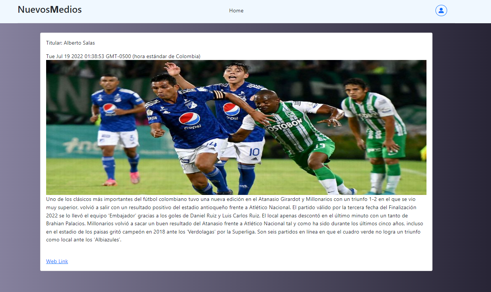

# NuevosMedios

Application created with the Javascript Framework (Angular) and Firebase with non-relational database.

 
 
  

This project was generated with [Angular CLI](https://github.com/angular/angular-cli) version 14.0.5.

The application was created for users who publish advertising content, such as news or relevant topics that may interest the general public.
when starting the user can interact with the published topics and look at the details of said topics,
If the user wants to interact more with the application, he must log in, so that his data is stored in the firebase database.
a new user must register their data, when doing so they must go to their email to validate their entry to the platform after that you can enter.

Upon entering after logging in and having validated their information, the user will be able to create their own publications and store them in 
their own component, and in turn will also be able to delete them.

## Development server

Run `ng serve` for a dev server. Navigate to `http://localhost:4200/`. The application will automatically reload if you change any of the source files.

## Code scaffolding

Run `ng generate component component-name` to generate a new component. You can also use `ng generate directive|pipe|service|class|guard|interface|enum|module`.

## Build

Run `ng build` to build the project. The build artifacts will be stored in the `dist/` directory.

## Running unit tests

Run `ng test` to execute the unit tests via [Karma](https://karma-runner.github.io).

## Running end-to-end tests

Run `ng e2e` to execute the end-to-end tests via a platform of your choice. To use this command, you need to first add a package that implements end-to-end testing capabilities.

## Further help

To get more help on the Angular CLI use `ng help` or go check out the [Angular CLI Overview and Command Reference](https://angular.io/cli) page.
